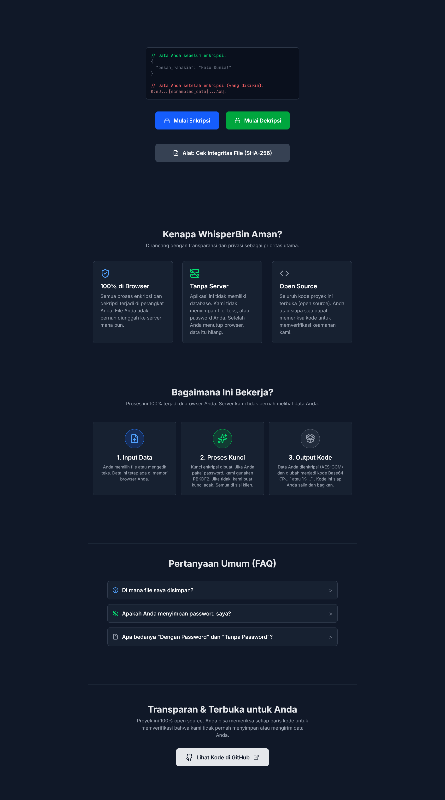

# WhisperBin 🤫

[](https://vercel.com/new/clone?repository-url=https%3A%2F%2Fgithub.com%2Fifauzeee%2FWhisperBin)
[](https://opensource.org/licenses/MIT)
[](https://nextjs.org/)

Encrypt and share files or text with complete privacy. **WhisperBin** runs entirely in your browser—your data never leaves your device.

### [➡️ Try the Live Demo ⬅️](https://whisper-bin.vercel.app/)

---

<p align="center">
  
</p>

## 🚀 Features

- **Client-Side Encryption:** Securely encrypt files or text using AES-GCM directly in your browser.
- **Two Encryption Modes:**
  - **Password Protected (`P:`)** — Uses PBKDF2 with 100,000 iterations to derive a strong key from your password.
  - **Passwordless (`K:`)** — Generates a random key and embeds it in the output for quick scrambling.
- **Large File Support:** Download encrypted output as `.txt` to bypass clipboard limits and re-import for decryption.
- **Integrity Checker:** Verify files using a built-in SHA-256 hash calculator.
- **Modern UI:** Responsive interface with smooth GSAP-powered animations.

---

## 🛡️ Privacy by Design

This isn’t just a promise—it’s enforced by architecture.

- **100% Client-Side:** All encryption, decryption, and hashing are handled via the [Web Crypto API](https://developer.mozilla.org/en-US/docs/Web/API/Web_Crypto_API). No data is sent to any server.
- **No Backend, No Database:** WhisperBin stores nothing. Once you close the tab, your data is gone.
- **Open Source:** Every line of code is publicly available for inspection and verification.

---

## ⚙️ How It Works

WhisperBin uses two encryption modes, each with a distinct output prefix:

### 🔐 `P:` Mode — Password Protected

1. You provide a file or text and a password.
2. A random 16-byte salt is generated.
3. PBKDF2 derives a 256-bit key using SHA-256 and 100,000 iterations.
4. AES-GCM encrypts the data with a random 12-byte IV.
5. Output format:
   ```
   P:<filename>.<filetype>.<salt>.<iv>.<encrypted_data>
   ```

### 🔓 `K:` Mode — Passwordless

1. You provide a file or text (no password required).
2. A random 256-bit AES-GCM key is generated.
3. AES-GCM encrypts the data with a random 12-byte IV.
4. Output format:
   ```
   K:<filename>.<filetype>.<raw_key>.<iv>.<encrypted_data>
   ```

---

## 🛠️ Tech Stack

- **Framework:** [Next.js](https://nextjs.org/) (App Router)
- **Language:** [TypeScript](https://www.typescriptlang.org/)
- **Styling:** [Tailwind CSS](https://tailwindcss.com/)
- **Crypto:** [Web Crypto API](https://developer.mozilla.org/en-US/docs/Web/API/Web_Crypto_API) (via Web Worker)
- **Animation:** [GSAP](https://gsap.com/)
- **UI Library:** [React](https://reactjs.org/)
- **Icons:** [Lucide React](https://lucide.dev/)
- **Password Strength:** [zxcvbn](https://github.com/dropbox/zxcvbn)

---

## 🏁 Getting Started

To run locally:

1. Clone the repository:
   ```bash
   git clone https://github.com/ifauzeee/WhisperBin.git
   cd WhisperBin
   ```

2. Install dependencies:
   ```bash
   pnpm install
   # or
   npm install
   # or
   yarn install
   ```

3. Start the development server:
   ```bash
   pnpm run dev
   ```

4. Open [http://localhost:3000](http://localhost:3000) in your browser.

---